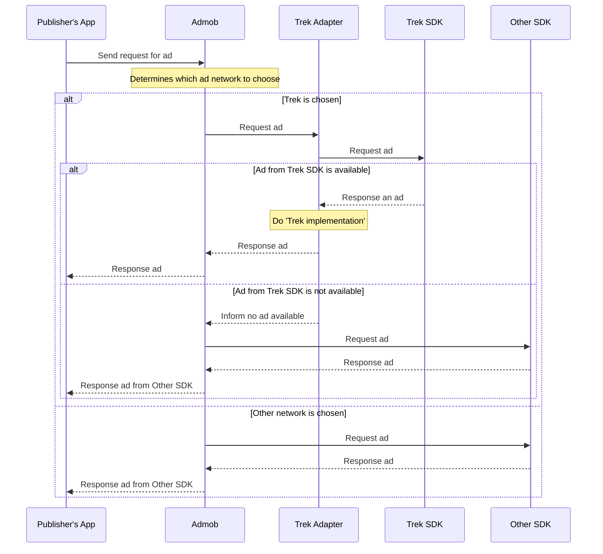

# trek-sdk-ios-admob-mediation-objc

拆分兩個 branch，分別因應 Google ads sdk v7 & v8

- master_admob_mediation_v7 -> 管理 v7 的 Admob Mediation file (Native & Banner)
- master_admob_mediation_v8 -> 管理 v8 的 Admob Mediation file (Native & Banner)

版號支援:

單號支援 v7: 1.0.1、1.0.3

雙號支援 v8: 1.0.2、1.0.4

Change log:

2021/09/15: 

version 1.0.6， fixed cocoapods x86_64 install warning message. And v7(1.0.3) is deprecated.

2021/08/09: 

version 1.0.3 、 1.0.4 ，fixed the issue of banner ads crashing under iOS 13.

# Digram for admob adapter

